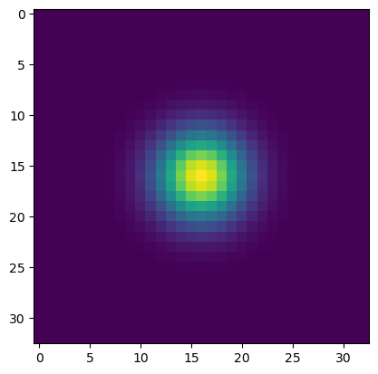

# Journal

Here you will find all the notes and reasoning used to reach the solution presented in this repository. The notes are divided into sections, each of which represents a working session conducted to address the issue.

## Session I - Problem 

On the path to solving the presented challenge, the first step was to deeply understand the problem. Taking the time to read through the challenge attentively, my mind inevitably started to craft a solution before having all the background information. However, I quickly realized that the core of the problem lay in localization.

Convinced that the optimal approach to tackle the challenge was to employ a neural network with the Unet architecture, I adopted a similar strategy to the one presented in the [CenterNet](https://arxiv.org/abs/1904.07850) paper. My focus shifted towards transforming the task into an image-to-image one, generating heatmaps as the output of the neural network (Figure 1). Executing this task was simplified by creating a black image and overlaying a Gaussian kernel at the phone's location, representing its localization.

Creating heatmaps is relatively simple. It involves generating a black image, which is essentially a matrix of zeros, and then placing a Gaussian kernel on it. The kernel has a size 'k' and a standard deviation 'sigma,' positioned through an affine transformation dictated by a transformation matrix

$$\begin{bmatrix}
1 & 0 & dx \\
0 & 1 & dy \\
\end{bmatrix}$$

  
     
  <em>Figure 1 Gaussian Kernel</em>

Although I had a clear idea of how to solve the problem, my experience taught me not to rush into a solution without a complete understanding of the problem. Therefore, despite having a rough plan, I took the necessary time to reread the challenge. It was then that I realized the available data was normalized, rendering the planned solution invalid. To create the heatmaps, it was necessary to convert the normalized location coordinates into integers, losing the decimal part.

In response to this new insight, I adopted a different approach, focusing on creating a neural network with a backbone and a DNN. This design would allow obtaining an output corresponding to the coordinate pair (x, y), addressing the problem more precisely and adapting to the nature of the normalized data.

## Session II - Design 

Now that I have a clear understanding of how to approach the problem, the crucial phase begins: designing a meaningful architecture. Two options were presented here: using a pre-trained "backbone" and DNN or creating a custom architecture from scratch. Each approach has its advantages and disadvantages, but personally, I believe that developing a custom architecture provides greater flexibility to the problem.

However, I'm bothered by the limitation of the "backbone" and DNN architecture in having a fixed input. For this reason, the decision was made to implement a fully convolutional network that doesn't restrict the size of the input to the network, as long as it is a multiple of a power of two (more details on this later). With this decision made, the next step was to design the structure of the neural network.

To start the design of the neural network, it is crucial to decide on the depth of the network, taking into account the dimensions of the available images, which in this case are 490x326. However, these dimensions are not multiples of powers of two.

In my design approach, I propose that the neural network reduces the size over 5 layers. Therefore, the input to the network should be a multiple of 2**5, which is 32. To achieve this, the image can be scaled to a size that is a multiple of 32 using the rule $resize = original - (original \mod 32)$. This results in a resized image of 480x320.

It is important to note that this resizing process should not only be applied to the input images but also to the corresponding labels. To do this, the scale factor for each axis should be calculated and applied to the labels. This consideration is essential to ensure accurate model inference.

It is time to decide which blocks will be used in the construction of the neural network. In my opinion, to achieve an optimal neural network for this problem, I suggest using VGG blocks, ResnetV2 with [Shake-Shake regularization](https://arxiv.org/abs/1705.07485), and a downsampling block. You can find the implementation of these blocks within the utils.models.modules module. The combination of these elements should provide a robust and efficient architecture to address the problem at hand.

Next, we detail how the spatial and semantic dimensions of the image change along the neural network.

|     Block    |  Name  |   Dimension  |
|:------------:|:------:|:------------:|
|     Input    |  Input |  bx3x320x480 |
|      Vgg     |  Conv1 | bx32x320x480 |
| DownSampling | DConv1 | bx64x160x240 |
|   ResnetV2   | Conv2  | bx64x160x240 |
| DownSampling | DConv2 | bx128x80x120 |
|   ResnetV2   | Conv3  | bx128x80x120 |
| DownSampling | DConv3 |  bx256x40x60 |
|   ResnetV2   | Conv4  |  bx256x40x60 |
| DownSampling | DConv4 |  bx512x20x30 |
|    Conv2d    | Convfc |      bx2     |

## Session III - Implementation

After defining the neural network architecture, the next step is the practical implementation of the project. This involves creating a dataset using PyTorch's Dataset class, which facilitates the incorporation of data augmentation through transformations available in torchvision. These transformations enhance the diversity of the dataset and contribute to better model performance.

Once the dataset is ready, the training loop is implemented. It begins with encoding the neural network, using the Mean Squared Error (MSE) loss function for initial tests of the forward pass. During training loop evaluations, it becomes evident that the regularization provided by Shake-Shake is insufficient. Consequently, the decision is made to introduce dropout to the neural network to improve model generalization.

Additionally, a function is introduced to search for the optimal value of the learning rate (lr_max) for the scheduler. This search is crucial for effectively adjusting the learning rate during training, optimizing the model's convergence. Furthermore, a scheduler, such as [OneCycleLR](https://arxiv.org/abs/1803.09820), is implemented to dynamically adjust the learning rate during the training process, enhancing convergence speed and stability.

All implementations can be reviewed in the available code, with the model residing within utils.models.model, while the rest is organized within the utils directory.

## Session IV - Future Steps

As pending tasks, it is necessary to implement data augmentation that affects the labels. This involves applying rotations, vertical flipping (flipud), horizontal flipping (fliplr), among other transformations, to further expand the dataset. It is important to consider that the coordinates are normalized. Therefore, to apply these transformations to the labels, it is necessary to translate the origin of the image from the upper-left corner to the center (0.5, 0.5). After applying the transformation, the origin should be returned to its initial position.

Additionally, the neural network corresponding to the backbone and DNN needs to be implemented. This process is not complex; only the last layers of the current network need to be changed to allow performance comparisons between both architectures. It is worth noting that this architecture is limited to the inputs of the network.

Another pending step is to create a script that allows exporting the model to ONNX format for subsequent deployment in production. Furthermore, a Dockerfile needs to be developed to streamline the transition of the model to production efficiently.